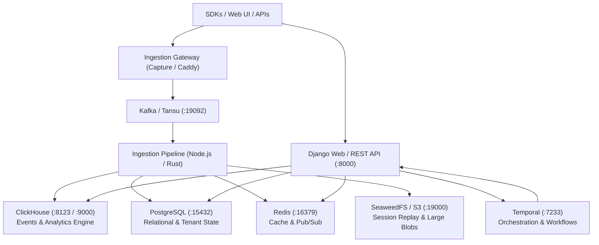

# PostHog Repository Architecture & Overview

This document outlines the high-level architecture of the PostHog codebase, directory layout, microservice topology, and system boundaries.

---

## 1. Monorepo Structure

PostHog is structured as a multi-language monorepo housing the core analytics engine, ingestion pipeline, feature products, user interface, background workers, and developer tooling.

```text
posthog/
├── posthog/                   # Django Core Application & Backend APIs
│   ├── api/                   # Base REST APIs and viewsets (DRF)
│   ├── models/                # Core Postgres domain models (Team, User, Organization, FeatureFlags)
│   ├── queries/               # Classical ClickHouse analytics queries & HogQL engine
│   ├── settings/              # Django runtime configuration (split by web, async, data stores)
│   └── temporal/              # Temporal workflow & activity definitions
├── products/                  # Modular Product Engines (Verticals)
│   ├── analytics/             # Product Analytics & Dashboards
│   ├── session_replay/        # Session Recording & Mobile Replay
│   ├── feature_flags/         # Feature Flags & Remote Config
│   ├── error_tracking/        # Error Tracking & Symbolication
│   ├── data_warehouse/        # External Sources, S3, Snowflake integrations
│   ├── conversations/         # Support & In-app Customer Conversations
│   ├── business_knowledge/    # AI Domain Knowledge & Learning extraction
│   └── ...                    # (Each product isolates backend, frontend, tests)
├── frontend/                  # React + TypeScript Web Application
│   ├── src/
│   │   ├── scenes/            # Scene-level page components and routers
│   │   ├── lib/               # Shared utilities, components, Lemon UI
│   │   └── layout/            # Navigation, headers, app chrome
│   └── package.json           # Vite + Kea + TypeScript setup
├── rust/                      # High-Performance Ingestion & Edge Services
│   ├── capture/               # Event ingestion gateway (HTTP -> Kafka)
│   ├── personhog/             # Person & group routing / identity service
│   ├── hook-janitor/          # Webhook retries & janitor jobs
│   └── ...
├── services/                  # Auxiliary Microservices
│   ├── llm-gateway/           # Python LLM proxy & attribution (transitioning to ai-gateway)
│   └── mcp/                   # Model Context Protocol servers & catalog
├── enve.cue                   # Rootless hermetic environment, runtimes, tools & microservice spec
├── enve.lock                  # Deterministic toolchain & package lockfile
├── showcase/                  # Developer Experience (DevEx) & Benchmarking
│   ├── scripts/               # PR evaluation, test scoping, CI parity comparison
│   └── Justfile               # Showcase-specific developer automation tasks
└── Justfile                   # Root developer workflow & test orchestration
```

---

## 2. Microservice Topology & Data Stores

PostHog relies on a distributed datastore architecture optimized for fast ingestion, real-time analytics, and transactional state.



### Datastore Breakdown:

1. **PostgreSQL (Port 15432 / default 5432)**:
   - Primary transactional store for users, teams, organizations, feature flags, permissions, insight configurations, and dashboard layouts.
2. **ClickHouse (Port 8123 HTTP, 9000 Native)**:
   - Columnar OLAP engine storing raw immutable events (`events`), session recordings metadata, person overrides, and materialized views.
   - HogQL compiles SQL-like queries into optimized ClickHouse dialect.
3. **Redis (Port 16379 / default 6379)**:
   - Ephemeral caching, rate-limiting token buckets, Celery task queues, and user session management.
4. **Kafka / Tansu (Port 19092)**:
   - High-throughput streaming buffer capturing raw event payloads before deduplication, person resolution, and ingestion into ClickHouse.
5. **Temporal (Port 7233)**:
   - Durable execution engine for long-running workflows: data warehouse syncs, batch exports, AI analyses, and external webhook deliveries.
6. **SeaweedFS / S3 (Port 19000)**:
   - Object storage for session recording snapshots, symbolication files, and export files.

---

## 3. Layer Boundaries & Architectural Isolation

### Product Isolation Pattern (`products/<name>`)

- PostHog utilizes an architectural boundary between core platforms and product verticals (`products/*`).
- Each product directory maintains its own backend models, API serializers, frontend components, and test suites.
- Cross-product communication must adhere to typed contracts and product facades rather than cross-importing internal ORM models or internal React state.

### Frontend Architecture (Kea + React)

- State management uses **Kea**, an event-driven framework built on Redux.
- Logic is strictly separated from presentation:
  - `*Logic.ts`: Manages actions, reducers, selectors, and async listeners.
  - `*.tsx`: Pure presentation rendering UI based on logic values and calling actions.
- Kea listeners handle async side-effects, API calls, and cross-logic orchestration.

### Person & Group Data Routing (PersonHog)

- Identity resolution and person mutations do not query raw tables directly.
- The `personhog` client provides point lookups by distinct ID/UUID, while aggregate properties and search run through ClickHouse queries.

---

## 4. Unified Hermetic Foundation (`enve`)

Rather than fragmenting the development experience across disparate system packages, Docker daemons, or machine-dependent paths, PostHog utilizes **`enve`** (`enve.cue` & `enve.lock`) as its single source of truth for:

1. **Hermetic Toolchains & Compilers**: Python, Node.js, Go, Rust (`rustc`, `cargo`, `clippy`), and developer CLIs (`just`, `watchexec`, `ripgrep`, `jq`).
2. **Deterministic Binary Resolution**: Eliminates "works on my machine" issues by pinning exact package hashes in `enve.lock`.
3. **In-Process Microservice Topology**: Replaces heavy, memory-intensive Docker Compose setups with native, rootless services running against localhost on fast tmpfs/RAM storage.
4. **Environment Unification**: Bridges local development environments with headless CI workflows under one uniform declarative specification.
